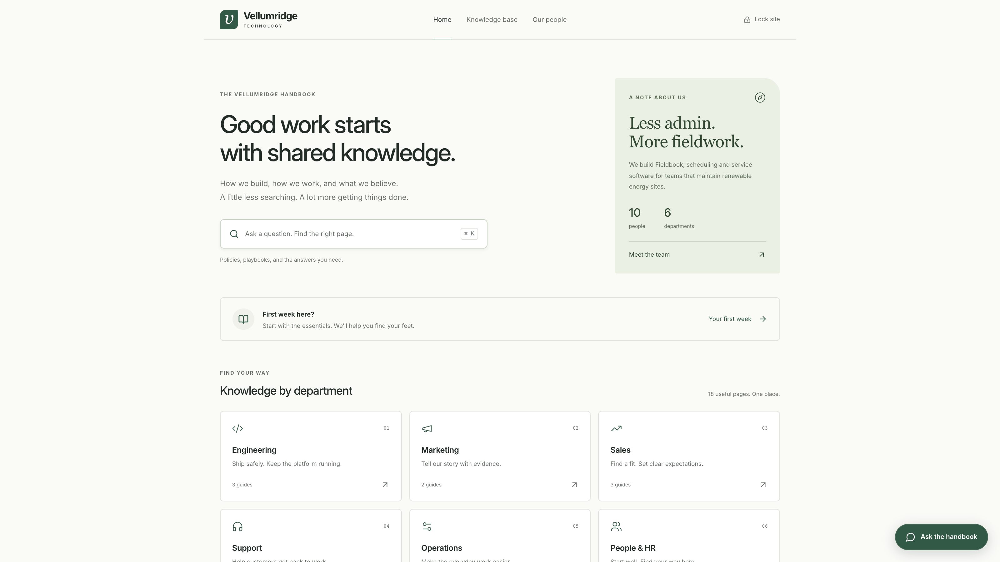
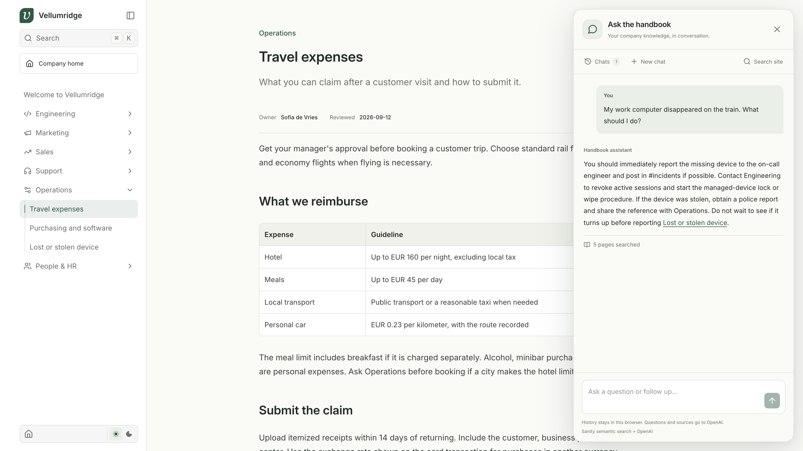

# Company knowledge base

A small company handbook built with Next.js and Fumadocs. Start with local Markdown, then use Sanity for editing and hybrid keyword plus semantic search. An optional OpenAI chat panel answers questions from those same pages.

Vellumridge Technology is a fictional 10-person company building field-service software. The repository includes a homepage and 10 employee profiles and 18 short pages across Engineering, Marketing, Sales, Support, Operations, and People & HR.



## Run locally

Use Node.js 22.12 or newer (Node 24 LTS recommended). Clone or download this repository, open its folder in a terminal, then run:

```bash
git clone https://github.com/daveebbelaar/company-knowledge-base.git
cd company-knowledge-base
npm ci
cp .env.example .env
# Set SITE_PASSWORD in .env.
npm run dev
```

On PowerShell, use `Copy-Item .env.example .env` instead of `cp`; in Windows Command Prompt, use `copy .env.example .env`. If you already have a `.env`, add the missing settings rather than replacing it.

Open [localhost:3000](http://localhost:3000) and enter your `SITE_PASSWORD`. Local mode includes the complete homepage, 18 pages, 10 people, owner links, and avatars without a Sanity or OpenAI account. Search is clearly labeled as keyword search. The chat panel explains that it needs an OpenAI key before it can answer.

Stay on `main` for the whole walkthrough. `CONTENT_SOURCE=local` reads Markdown and employee JSON from `content/`. Adding a Sanity token does not change that setting. Later, import those files into your own project, set `CONTENT_SOURCE=sanity`, and restart the website to read published Sanity documents instead.

The first import copies your current local content. Later imports preserve existing Sanity edits; there is no automatic sync in either direction. Switching back to local mode shows the local files again. In Sanity mode, configuration errors are reported rather than silently falling back to those files.

## Connect Sanity

The website stays on localhost. Sanity's Content Lake is hosted, so this stage sends only the fictional starter content to your Sanity project.

Use the free Growth trial to learn with the private dataset this example requires. The ongoing Free plan supports semantic search but only public datasets. Sanity says private datasets become public after a trial downgrades to Free, so keep this to fictional content unless you arrange continued private access. See the [trial terms](https://www.sanity.io/docs/platform-management/growth-plan-trial) and [current pricing](https://www.sanity.io/pricing).

1. Create an account at [Sanity](https://www.sanity.io/get-started) and a project in [Manage](https://www.sanity.io/manage). Copy the project ID.
2. In the project's API settings, create a Developer token (labeled "Recommended for agents") for dataset setup and import. Set `SANITY_STUDIO_PROJECT_ID`, `SANITY_API_KEY`, and `SANITY_STUDIO_DATASET=knowledge` in `.env`.
3. Run the setup and import:

```bash
npm run sanity:setup
npm run sanity:import
npm run sanity:status
```

Setup creates a **private** dataset and enables Dataset Embeddings for page text and employee names, roles, bios, and responsibilities. It refuses to repurpose a public dataset. Wait until embeddings are ready; after an import, new documents may need another minute before semantic results appear.

4. Change `CONTENT_SOURCE=sanity` in `.env` and restart `npm run dev`.
5. In another terminal, run `npm run studio`. Open [localhost:3333](http://localhost:3333), sign in to Sanity, edit a knowledge page, and click Publish. Refresh the website to see the published version.

If Studio asks to allow a local origin, add `http://localhost:3333` in the project's API → CORS origins with credentials enabled. Use that exact hostname consistently. Studio uses your Sanity login; the website password does not grant editing rights.

To give colleagues an editor they can open without a local server, run `npx sanity login`, then `npx sanity deploy`. Choose your own hostname and bookmark the returned Studio URL. Local and hosted Studio edit the same dataset. Publishing a policy does not redeploy the handbook; changes to Studio's schema or configuration require another Studio deployment.

Only the project ID and dataset have the `SANITY_STUDIO_` prefix, because Studio needs those public identifiers. Never give an API token that prefix.

The import uses `createIfNotExists`, so running it twice preserves existing Studio edits. Once you switch modes, edit content in Studio. Local Markdown is the portable starting material, not a second live copy.

## Find the right person

Open [Team directory](http://localhost:3000/docs/team) for 10 fictional colleagues. Each profile has a role, short bio, responsibilities, and links back to the pages they own. Click an owner name beside a page's review date to open their profile.

Local mode reads the JSON files in `content/employees`. In Sanity mode, edit **Employee** documents in Studio. Knowledge pages have an **Owner profile** reference, so changing a person's name does not break their page links. The original owner text supports local Markdown.

The existing setup/import commands also import employees and add missing owner references by matching names. They preserve existing profile and policy content. If you used an earlier version, rerun `npm run sanity:setup` and `npm run sanity:import` to include employee fields in embeddings, then wait for `npm run sanity:status` to report ready.

Try `Who should I ask about using a customer logo?` or `Who handles custom customer payment terms?`. The same semantic query searches policies and profiles. The chat can cite a person's profile and distinguish a policy owner from the person who approves a request.

Avatars are local SVG files from [DiceBear's Notionists style](https://www.dicebear.com/styles/notionists/), created by Zoish under CC0. Their filenames match profile slugs. A new profile without a matching avatar shows initials; no live image service is needed. All people and their responsibilities are fictional.

## Enable chat

Add an [OpenAI project API key](https://platform.openai.com/api-keys) to your existing `.env`, then restart the website. API usage needs billing on your OpenAI project.

```dotenv
OPENAI_API_KEY=your-openai-api-key
OPENAI_MODEL=gpt-5.6-luna
```

GPT-5.6 Luna with reasoning disabled is the default. The [local benchmark](docs/model-benchmark.md) compares its response times and source links with other models. You can change `OPENAI_MODEL` to another OpenAI model that supports the Responses API and function calling. The key stays on the server.

Click **Ask the handbook** in the bottom corner. Ask `What can I claim for meals after visiting a customer?`, then `How long do I have to submit the claim?`. Open the cited policy to check the EUR 45 daily limit and 14-day deadline. The panel also opens site search and lets you start, resume, or delete chats.



Each turn makes two OpenAI calls. The first turns the conversation into a `search_knowledge` tool call. The server runs the existing Sanity semantic query and returns up to five pages. The second call streams an answer with source links. OpenAI never receives the Sanity token or permission to run arbitrary GROQ. In local mode, the same flow uses keyword retrieval.

Conversation history lives in this browser's `localStorage`, capped at 10 chats and 40 messages per chat. The most recent 12 completed messages go to OpenAI with the retrieved pages. The app has no server conversation database and sets `store: false` on Responses requests. This does not mean questions stay on your computer; OpenAI processes them under its [API data controls](https://developers.openai.com/api/docs/guides/your-data). Sanity receives the search query. Clear browser history from the panel's Chats view; histories do not sync between devices and remain on the device after locking the site.

Sanity documents a broader MCP integration in [Sanity Context](https://www.sanity.io/docs/ai/sanity-context). This demo keeps one fixed search tool so the retrieval and answer flow fits the walkthrough. The model is instructed to say when the handbook lacks an answer. Check its citations; generated answers can still be wrong.

## Understand the code

| File | Job |
| --- | --- |
| `app/page.tsx` | Company homepage |
| `app/docs/layout.tsx` | Classic Fumadocs layout and department sidebar |
| `app/docs/[[...slug]]/page.tsx` | Render a Markdown page |
| `lib/content.ts` | Select one content source and build the Fumadocs page tree |
| `lib/local-content.mjs` | Read Markdown and frontmatter |
| `sanity/schema.ts` | Knowledge pages, employees, and owner references |
| `content/employees/` / `lib/people.ts` | Local profile seeds and the selected employee source |
| `app/docs/team/page.tsx` | Team directory |
| `lib/sanity.mjs` | Sanity client and the GROQ search query |
| `app/api/search/route.ts` | Server-side search, protected by the password gate |
| `lib/retrieval.ts` | Shared retrieval for search and chat |
| `app/api/chat/route.ts` | OpenAI tool call, handbook retrieval, and streamed answer |
| `components/chat.tsx` | Chat panel and browser-local conversation history |
| `components/search.tsx` | Fumadocs overlay, modes, results, and error states |
| `proxy.ts` / `lib/access.mjs` | Shared-password gate and signed cookie |

This uses the same Next.js, Tailwind v4, and classic Fumadocs layout pattern as Datalumina Docs. The leaner content layer reads plain `.md` files and renders them with `react-markdown`; there is no MDX compiler or arbitrary JavaScript in content. Studio stores metadata as typed fields and the body in a Markdown text field. A rich-text editor can be a later extension.

## Try the search

Press Cmd+K (Ctrl+K on Windows/Linux), then compare Keyword, Semantic, and Hybrid.

| Query | Relevant page |
| --- | --- |
| `SEV-1` | Incident response |
| `My work computer disappeared on the train` | Lost or stolen device |
| `Who signs off on a cheaper quote?` | Discount approvals |
| `Can I spend December working from Lisbon?` | Remote work |
| `A customer wants their data to stay in Europe` | Data residency |

The search overlay returns source pages. The separate chat panel uses retrieved pages to write an answer. Semantic similarity can return unrelated pages when the handbook lacks an answer. Treat results as candidates and read the policy. Rankings depend on the query; hybrid is not automatically best on every example.

[Dataset Embeddings](https://www.sanity.io/docs/content-lake/dataset-embeddings) maintains the embeddings asynchronously. Our app calls `text::semanticSimilarity()` inside GROQ `score()` and combines it with keyword scoring. Search needs no separate vector database, LLM API key, or reranking service. Only the optional chat needs an OpenAI key.

## Password and deployment

`SITE_PASSWORD` signs a seven-day HttpOnly cookie. Changing the password invalidates existing cookies. Pages, search, and chat require the cookie, and a missing password fails closed. Use a long, unique password and HTTPS when hosting.

This is a shared gate for a demonstration. It has no individual identity, access audit, or per-department permissions, and its fixed delay is not distributed rate limiting. Use real organizational access control before storing sensitive company material. Keep the Sanity dataset private; a website password cannot hide a public Content Lake dataset.

For a later deployment, import the repository into a Next.js host such as Vercel. Use `npm run build`, set the variables from `.env`, and replace the setup token with a **Viewer** token for runtime reads. Keep the Developer setup token outside the deployed environment. The website does not need Studio deployed alongside it. A Node server can use `npm run start -- --hostname 0.0.0.0` when the host needs a network listener. Static export is not supported because the gate, search, and chat run on the server.

No public deployment is required to follow the tutorial. Check the current [Sanity plan quotas](https://www.sanity.io/pricing) before enabling external access; semantic queries consume a plan allowance.

## Verify and adapt

```bash
npm test
npm run check
npm run build
npm run studio:build
# With the website already running and .env configured:
npm run test:live
# Optional: makes paid OpenAI calls to check chat and follow-ups.
npm run test:chat
```

Ask your coding agent to read `AGENTS.md` and replace the demo content with your own company structure. Keep only one system authoritative for content. [The recording guide](docs/recording-guide.md) maps the project to a 20-minute walkthrough.
